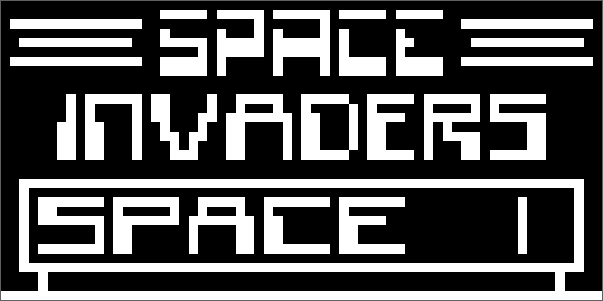

# chip8 emulator

A basic chip8 interpreter written to learn more about emulation and graphics.

## TODO
- [x] graphical rendering with SDL
- [x] correct cycle and timer timings
  - [ ] sprite flickering ??
- [ ] WebGL front
- [ ] Sprite wrapping on screen edges
- [ ] Window resizing
